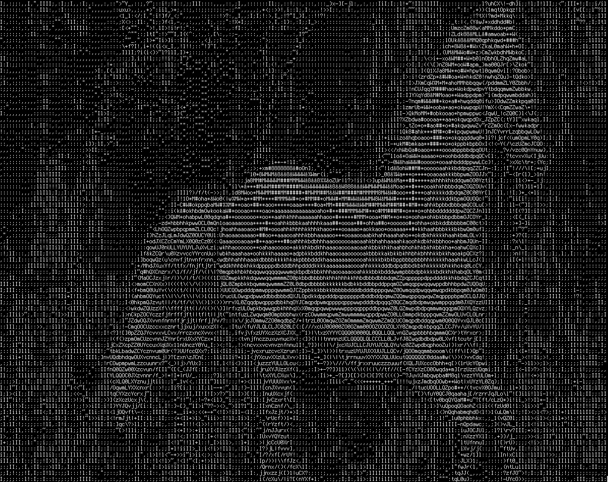

  

<h3 align="center">Ruby Pic2Text</h3>

  

    Program written in Ruby to translate images input through command line into ASCII.
    Utilizes RMagick, which is a wrapper for the ImageMagick library.
    As of right now it still requires some more work and I plan to 
    use it as a utility in a Rails application, and develop a React frontend for it.
  

  
  

    Requires ImageMagick and any of its bizarre annoying dependencies to be installed
    locally in order to work!
  

  
  

    Written by Will Phillips.
  

